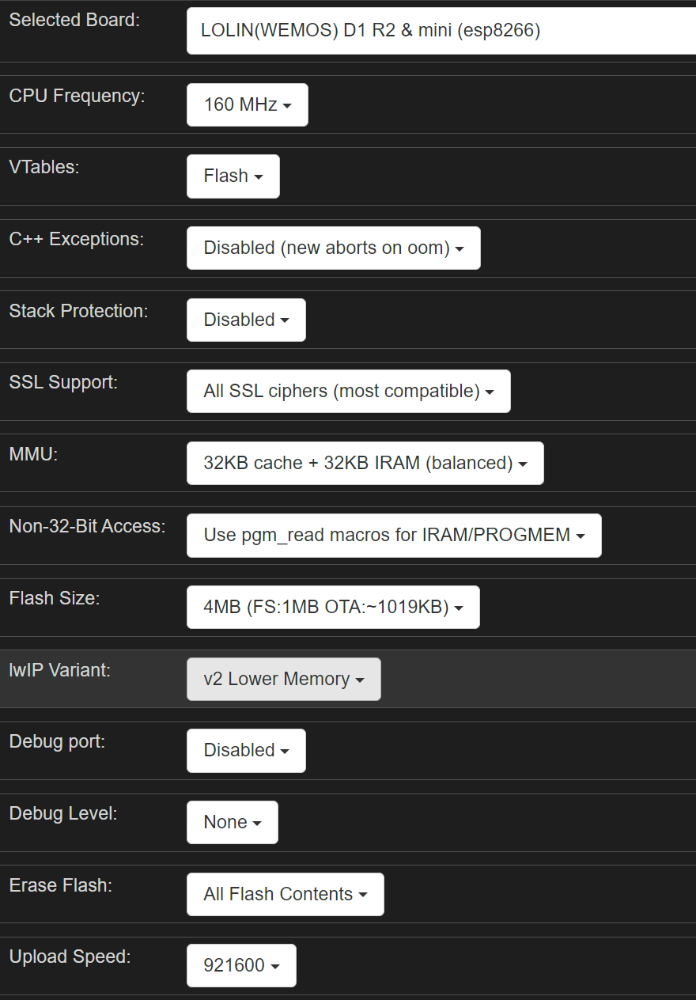
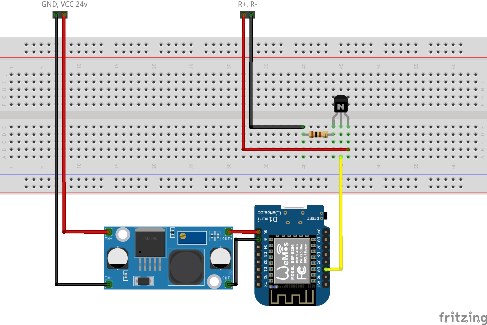

<div align="center">
    
</div>

# GrowBox
Model: <a target="_blank" href="https://amzn.to/3x9uhFN">MARS HYDRO TS1000 Growbox Kit</a>

This project aims to Automate GrowBoxes in order to make the freshes and biggest fruits / flowers of your plants. 
#### Working Features
 - Inline Fan Control for the analog fan.

#### Planned Features
 - Humidity / Temperature / Pressure GY-BME280.
 - Plant height, Supersonic.
 - Pump control for fertilizer, water. 
 - Water warning, via soil moisture? _Unclear if this can't be just calculated way better than probed._
 - EC / PH, _as the sensors are quite expensive i might skip this try or push it way back the road._


## Features
### API
API definition of the GrowBox, API is using JSON for data and plain text for errors. 

<hr/>

#### Index / Root
Returns the current context. 

<br/>
`http://growbox01/`
#### Response 

```json
{
    "fanSpeed": 150
}
```
<hr/>

#### Fan Set
Sets the fan speed, 255 = OFF, 0 = MAX. Fanspeed is stored in EEPROM / Context.

<br/>
`http://growbox01/fan/set`
#### Request
```json
{
    "fanSpeed": 150
}
```
#### Response 
 

The current context.

```json
{
    "fanSpeed": 150
}
```

## D1 Mini Board Config
<a href="./res/arduino.json">arduino.json</a> or:
<div align="center">
    
</div>

## Inline Fan Fritzing
100Ohm Resistor, BC337 Transistor, D1 Mini, 24v Stepdown.
If you dissassemble the Fan you will find GND, VCC, R+ R- as pins on the driver board. CAUTION 220v are transformed on the same board, be aware of it. The R+ and R- pins are connected to the control knob cable, I reused this.
<a href="./InlineFan.fzz">
    
</a>

### Amazon Basket

|Item|Description|
|-|-|
| <a target="_blank" href="https://amzn.to/3TDTPma">ESP-8622 D1 Mini</a> |  D1 Mini to operate the Web-API. |
| <a target="_blank" href="https://amzn.to/4avrZPI">Transistor BC337</a> |  A BC337 transistor.  |
| <a target="_blank" href="https://amzn.to/4aB79hM">100Ohm Resistor</a> |  A 100Ohm resistor.  |
| <a target="_blank" href="https://amzn.to/3VyUdVE">Some cables</a> |  I always take silicone wrapped cables because of their heat resistance and general durability.  
| <a target="_blank" href="https://amzn.to/3J1IyHe">24v Stepdown</a> | Any stepdown converter from 24v to 5v. |


_Those are affiliate links, use them if you want to support me :)_